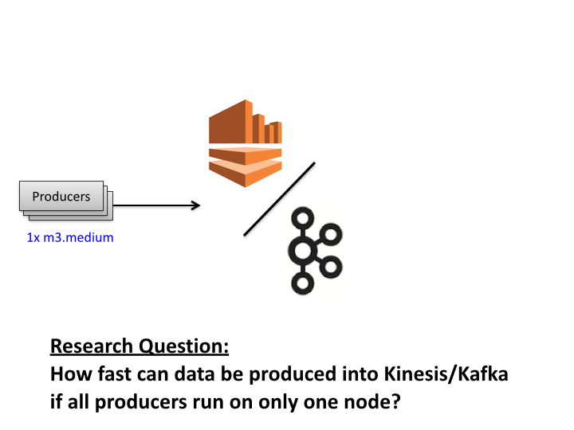
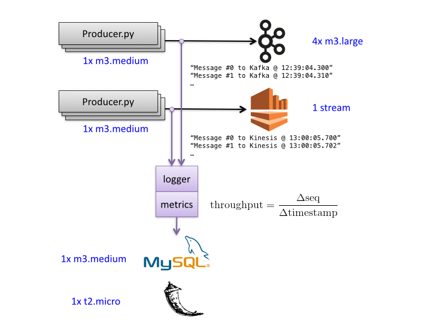
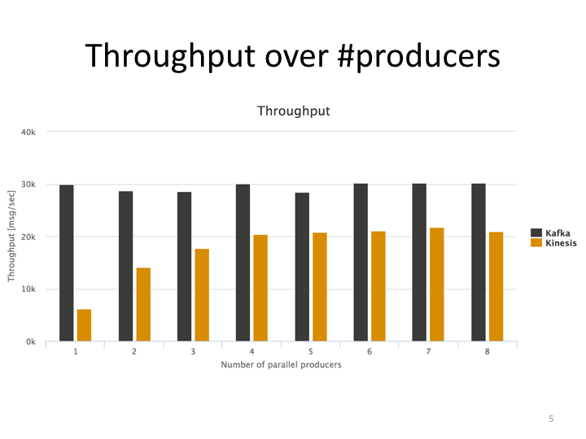
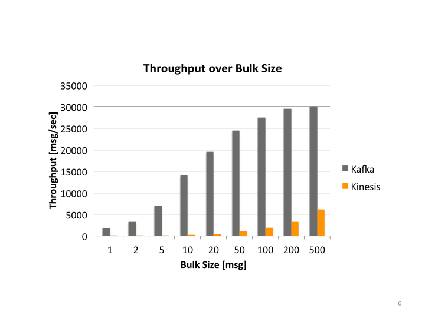

# ingestion_benchmark
This project compares two ingestion technologies: Kafka and AWS Kinesis.

## Research Question
How fast can data be produced into Kafka/Kinesis, if all producers run on only one node?

## Setup

In each experiment, a dedicated node host the producers, which send messages to the ingestion broker:

Kafka is running on a cluster of four nodes. Kinesis is consists of one stream per experiment. 

A message is a short string, that contains a sequential number that starts at 0 for each producer. In addition the string contains the timestamp when the message was created. 

A logger is attached to each producer. It notfies the metrics component after every few seconds, which calculates the throughput based on the message sequenece number and the timestamps.

The throughput is stored in a MySQL database, which runs on a dedicated node. The Flask frontend displays the results in a web browser.

## Results and Findings
Note, the results are also shown at www.thomasschreiter.link. 

Kafka maxed out at a throughput of 30k messages/sec. Even parallalizing did not affect the throughput. 

Kinesis achieved a throughput of 5k messages/sec for one producer. Increasing the number of parallel producers increased the throughput. The performance leveled out at four producers.

These results suggest that running a single producer is sufficient to achieve a high throughput in Kafka. If one wants to increase the throughput, then multiple producers have be distributed across multiple nodes. For Kinesis, it is beneficial to run up to four producers on the same node. 

In either case, Kafka outperformed Kinesis in all experiments.

The experiments on the previous diagram were executed with a bulksize of 500, i.e. 500 messages were sent to Kafka/Kinesis at the same time. The above diagram shows the throughput over bulksize. Sending only one message at a time leads to throughput of ca. 1600 messages/sec for Kafka, but only 30 messages/sec for Kinesis. The performance of Kafka leveled out at a bulksize of ca. 200 messages. The throughput of Kinesis increased drastically when increasing the bulksize. Kinesis currently allows a maximum bulksize of 500 messages; as the diagram suggest, potentially a higher throughput can be achieved if more messages could be sent in bulk.

## Conlusion
In all experiments, Kafka achieved a higher throughput than Kinesis. However, the differences between these two technologies are less than one order of magnitude. Since both are under development, performance improvements are to be expected in the future.  